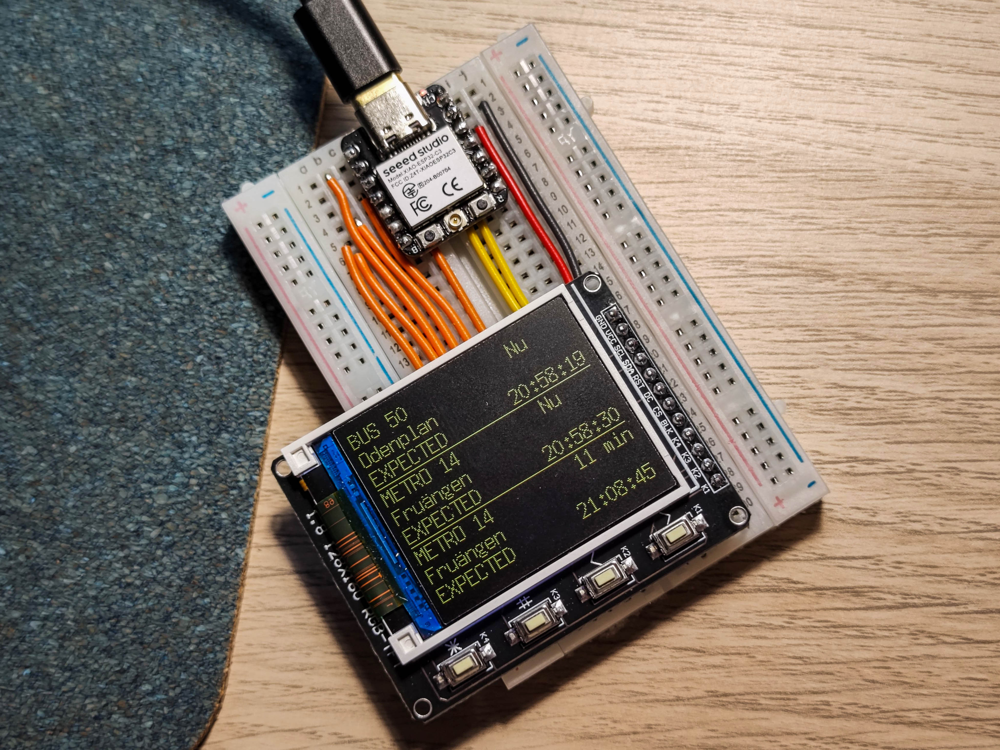

# DBHome: Departure Board at Home
*(the name is just a coincidence, not related to some train company)*  

## Introduction
Feeling unwell while standing near the bus stop for a long time? Especially during the cold winter in Stockholm? Install a departure board at home!  

Actually, without DBHome, you can still check the real-time schedule on the [SL App](https://sl.se/en/in-english/fares--tickets/smart-phone-ticket-app). However, I'm too lazy to click the buttons, and I found that [SL provides API for requesting traffic status](https://www.trafiklab.se/api/trafiklab-apis/sl/transport/).  

So, I built [DBHome](https://github.com/CSY-tvgo/DBHome). After setting the `SiteId` and the `direction_code`, you can let it always on in your dolce casa to display the real-time schedule.  

## Components
+ [XIAO ESP32C3](https://wiki.seeedstudio.com/XIAO_ESP32C3_Getting_Started/) (can be replaced with any other boards which also support WiFi, but this one only costs about 5€ including delivery from Germany to Sweden)
+ a ST7735 screen (can be replaced with any other screens)

## Usage
1. Visit [Trafiklab](https://www.trafiklab.se/api/trafiklab-apis/sl/transport/) to check the `SiteId` and the `direction_code` you want to set. Almost all buss, tunnelbanan, pendeltåg, och färjor are supported. Enter them into the code.
2. Enter the SSID and the password of your WiFi.
3. If you use the same components as mine, follow the steps on [Seeed Studio Wiki](https://wiki.seeedstudio.com/XIAO_ESP32C3_Getting_Started/) to download the code to the XIAO ESP32C3. Done.
